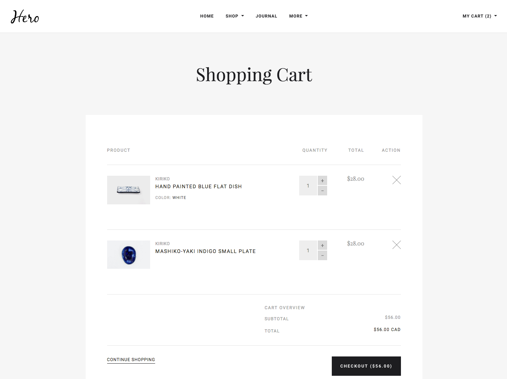

# Storefront Single-Page App

By _Tharaa Elmorssi_
---

## Application Overview
A React single-page app which renders a mock storefront that matches the provided screenshots, using the
supplied JSON and media files. The `products.json` file is accessed asynchronously using Fetch API to `'/products.json'`
* The storefront consists of three main screens: a category list page, a product details page, and a cart page (plus cart popup).
* Clicking the Add to Cart button on a product tile or on the product detail page adds the item to the cart dynamically in two different ways:
  * On Product Tile (grid item), one single item of that product is added to the cart on every click.
  * On Product Page, user selects the number of items to be added to the cart first, then the selected quantity is added to cart as one transaction on clicking Add To Cart button.
* Attempting to add a duplicate item to the cart instead increments the quantity for that item.
* It's possible to change quantities and remove items on the cart page. On changing the quantity on cart page, cart is updated instantly with every increment/decrement of the quantity.
* Cart totals are updated appropriately with every update, add or remove action to the cart.

## Assumptions
* I assumed that the assignment purpose is to assess coding/development skills and capabilities. Accordingly:
  * I did not use any of the ready online store React packages like `react-shopping-cart` or something like Moltin components.
  * I did not use a ready number picker package, and implemented one myself.
* Although only one category with one set of sample products were provided, I assumed that the app was meant to support multiple categories with different products in each. So:
  * An assumed _category_ object is passed to the _Category_ component from the parent _App_ component.
  * Fetching the products list from server is done in _Category_ component, not in the main _App_ component, which makes the products to be retrieved from server every time the user navigates to category page.
* Exact fonts and colors to be used are not provided. So, I picked the closest fonts and colors to those on the provided screenshots.
* The unit price of each product in the Shopping Cart page does not exist in the provided screenshot, but I thought that the importance of displaying it goes without saying. So, I added it in the application.

## What I would do if I had more time
* The UI currently properly responsive on screens bigger than or equal to **860 px** wide. If I had more time, I would use CSS media queries for a fully responsive app on smaller screens and mobile version.
* Would make sure that WCAG standards are sufficiently applied to ensure high web accessability.
* Would implement sample sub-menu in the navigation bar.
* Would add more functionalities to the _NumberPicker_ component to be more reusable for other applications. For example, minimum/maximum numbers settings and custom styles settings.
* Would add a feature of going to the Product Details page when the product title in the Shopping Cart page or cart popup is clicked (as a link).
* Would create more unit tests to cover more of the code. Currently, only the following unit tests are created:
  * Thorough unit testing of **_NumberPicker_** component
  * Few basic rendering unit tests of _App_, _Category_ and _Product_ components. 

## How To Run the App
This application requires [NodeJS](https:/s/nodejs.org/en/) and was created using
[create-react-app](https://github.com/facebook/create-react-app).

### To run the App as development build:
- Clone the App repository to a folder on your local machine via `git clone https://github.com/Tharaae/hero-storefront.git`
- Install all project dependencies with `npm install` in the project folder
- Start the app with `npm start`
- Browse to the provided URL

### To run the app as production build:
- Clone the submitted project repository to a folder on your local machine
- Install all project dependencies with `npm install` in the project folder
- Build the app for production with `npm run build` in the project folder
- Install serve with `npm i serve -g`
- Setup a static server for the app with `serve -s build` in the project folder
- Browse to the provided URL

### To test the App:
Run the tests with `npm test` then press `a` to run all tests.

## Application Details/Screeshots
### Home page
* Since sample products are provided for only one sample category, the home page is set as the category page.
* The app header including the app logo, navigation menu and My Cart link is displayed throughout the application on all pages.
* Home and Shop navigation menu items, both goes to the category page.
* Clicking the My Cart link displays the Cart Popup.

### Category List page:

* Clicking the My Cart link displays the Cart Popup.
* Hovering over one of the product tiles displays an overlay prompting the user to Add to Cart or View Details,
  as below:

### Cart Popup:

* Number of items in the cart is shown between brackets in the popup link. No brackets means empty cart.
* User can remove items from the cart using the popup.
* Removing any item in the popup updates the cart total instantly.
* The View Cart button takes user to the cart page.
* The Checkout button does nothing.
* When the popup is displayed, clicking anywhere outside it on the page dismisses the popup.

### Product details page:

* Clicking the My Cart link displays the Cart Popup.
* User can select the quantity required to be added to the cart using increment/decrement buttons.
* Clicking Add to Cart adds the selected quantity of that product to the cart.
* Number of cart items in the popup link is updated instantly on adding to cart.
* Added items are shown in popup cart if opened.

### Cart page:

* Clicking the My Cart link displays the Cart Popup.
* User can instantly increment or decrement quantity of a cart item using quantity button.
* User can remove any item from the cart using the x button.
* Quantity updates or removing any item in the cart updates the cart totals instantly, as well as the number of items in the cart popup link.
* The Continue Shopping link returns to the homepage.
* The Checkout button does nothing.
